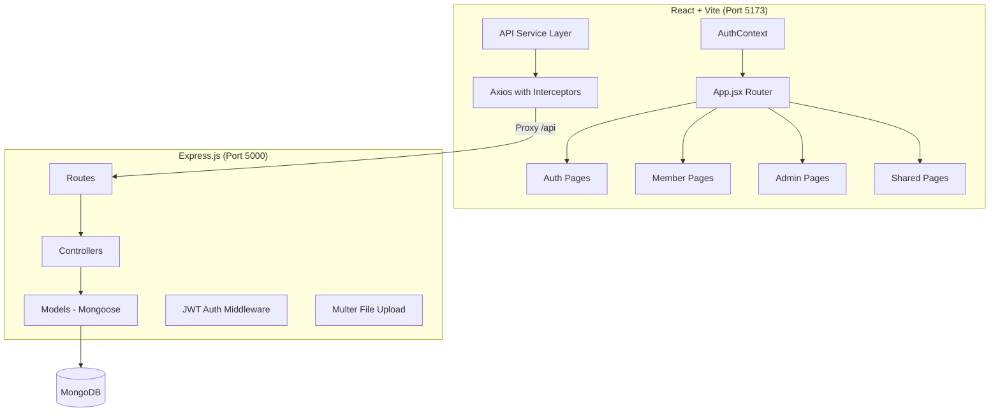

# LibraVerse — Library Management System Walkthrough

## Overview

LibraVerse is a **production-ready Library Management System** built with the MERN stack (MongoDB, Express, React, Node.js). It features a modern dark professional theme with glassmorphism effects and supports **32+ pages** across Admin and Member interfaces.

---

## Architecture



---

## Backend (Server)

### Models (8)
| Model | Purpose |
|-------|---------|
| **User** | Members & admins with bcrypt hashing, membership tiers |
| **Book** | Books, journals, magazines with text search indexing |
| **BorrowRecord** | Full borrow lifecycle tracking |
| **Fine** | Auto-calculated late return penalties |
| **WaitingList** | Queue management for unavailable books |
| **Category** | Book categories with virtual book counts |
| **ContactMessage** | User messages with reply support |
| **Settings** | Configurable library parameters |

### Controllers & Routes (9 modules, 40+ endpoints)
- **Auth**: Login, Register, Forgot/Reset Password
- **Users**: CRUD, Profile, Stats, Change Password
- **Books**: CRUD, Search, Categories, Stats, Availability
- **Borrows**: Request, Issue, Return, Renew, Reject, Overdue, Stats
- **Fines**: My Fines, Pay, Waive, Stats
- **Waitlist**: Join, Leave, My List
- **Contact**: Submit, Read, Reply
- **Reports**: Dashboard Stats, Member Dashboard
- **Settings**: Get/Update Library Configuration

### Business Logic
- **Fine calculation**: Auto-calculates based on overdue days × per-day rate from Settings
- **Membership-aware limits**: Borrow duration, max books, max renewals vary by tier
- **Waiting list**: Queue management with notification on book return

---

## Frontend (Client)

### Design System
A comprehensive CSS design system in `index.css` (1000+ lines) featuring:
- Dark professional theme with CSS custom properties
- Glassmorphism effects & gradient accents (blue, green, purple, orange)
- Complete component library (cards, tables, forms, badges, modals, tabs)
- Responsive breakpoints for mobile/tablet/desktop

### Pages Created (32+)

#### Auth Pages (4)
| Page | Features |
|------|----------|
| Login | Email/password, demo credentials, role-based redirect |
| Register | Full form with validation |
| Forgot Password | Email submission with success state |
| Reset Password | Token-based password reset |

#### Member Pages (14)
| Page | Features |
|------|----------|
| Dashboard | Welcome banner, stats cards, active borrows, recent activity |
| Search Books | Filter by category/type/availability, book cards, pagination |
| Book Details | Cover, metadata, availability stats, borrow/waitlist actions |
| Book Categories | Category cards with book counts |
| Borrowed Books | Status tabs, detailed table with overdue indicators |
| Return / Renew | Active borrows with renewal and return actions |
| Fines | Pending/paid stats, fine table with pay links |
| Pay Fine | Payment method selection, fine summary |
| Transaction History | Complete borrowing history table |
| Waiting List | Queue position, leave option |
| Journals & Magazines | Tabbed browsing by type |
| Membership | Pricing cards with feature comparison |
| Profile | Personal info, membership details, security |
| Edit Profile | Photo upload, info editing, password change tabs |

#### Admin Pages (10)
| Page | Features |
|------|----------|
| Dashboard | Stats cards, Bar & Doughnut charts, activity feed |
| Book Management | Data table, search, pagination, edit/delete |
| Add/Edit Book | Full form with cover upload, all metadata fields |
| Category Management | CRUD with modal, category cards |
| Member Management | Table, search, edit modal, activate/deactivate |
| Issue / Return | Tabs (pending/issued/overdue/returned), approve/reject/return |
| Fine Management | Stats, filter, waive fines |
| Reports & Analytics | Charts, popular books, membership distribution |
| Settings | Library info, fine config, borrow limits, fees |
| Contact Messages | View, reply modal, status filter |

#### Shared Pages (4)
| Page | Features |
|------|----------|
| About Us | Hero, features grid, impact stats, mission |
| Contact Us | Message form, contact info cards |
| Book Availability | Quick search with availability display |
| 404 Not Found | Styled error page with navigation |

---

## Verification Results

All pages have been tested and verified working:

### Admin Dashboard


### Book Management  


### Member Dashboard


### Search Books


### Book Details


---

## How to Run

```bash
# 1. Seed the database (first time only)
cd server && node seedData.js

# 2. Start backend
cd server && npm run dev

# 3. Start frontend (new terminal)
cd client && npm run dev

# 4. Open browser
# http://localhost:5173
```

### Demo Credentials
| Role | Email | Password |
|------|-------|----------|
| Admin | admin@library.com | admin123 |
| Member | rahul@example.com | member123 |
| Member | priya@example.com | member123 |
